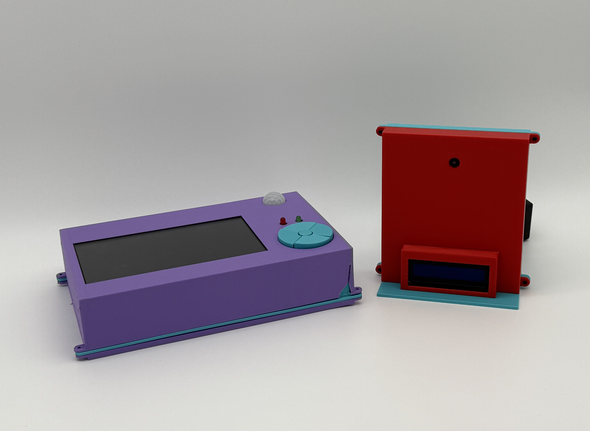
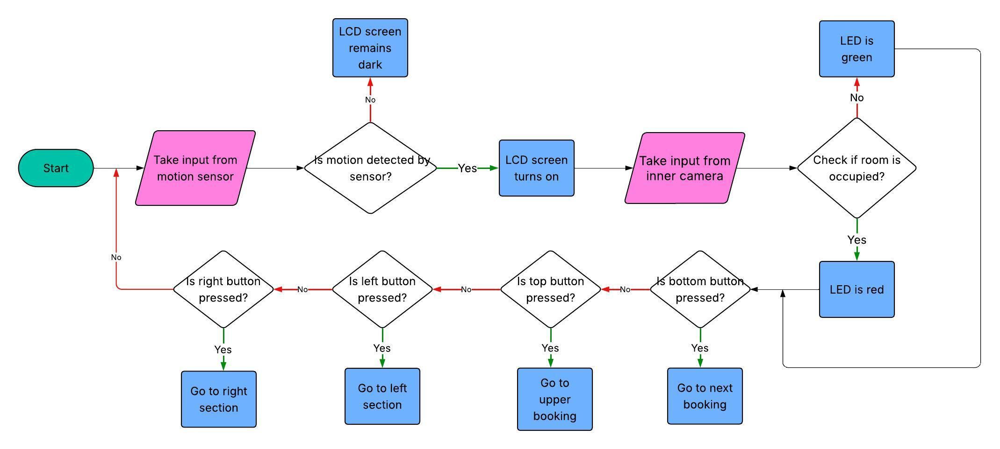
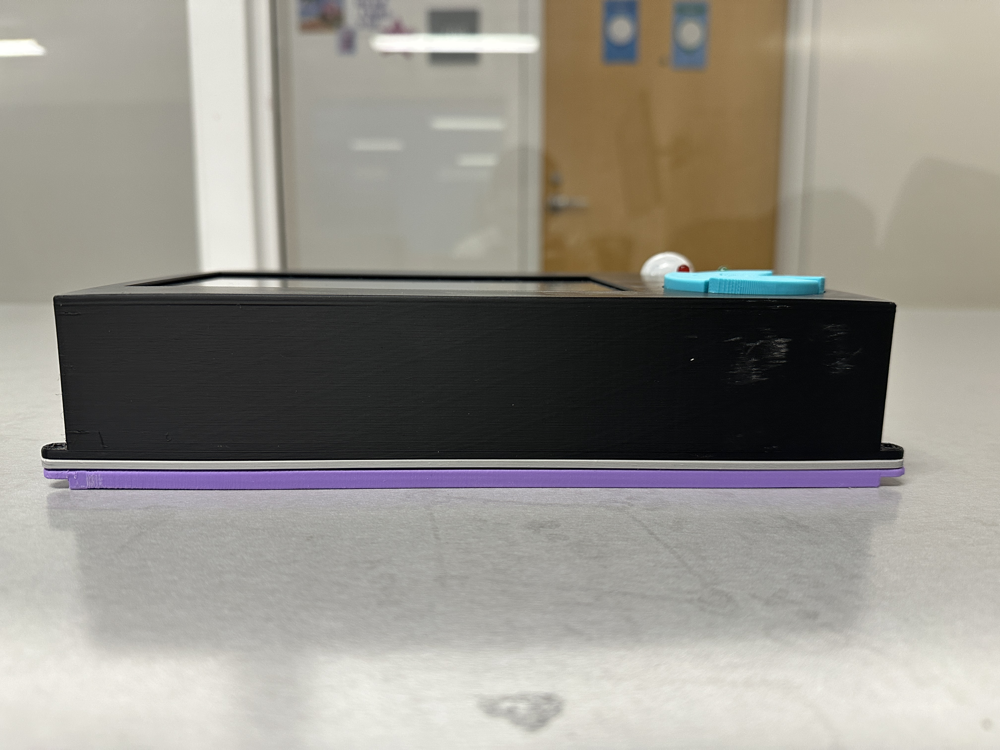
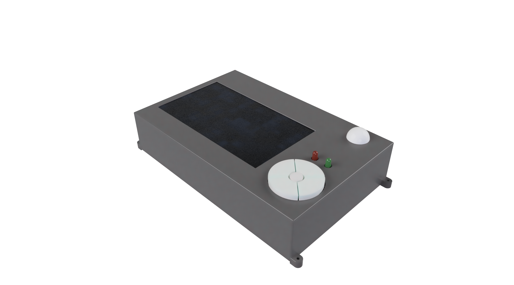
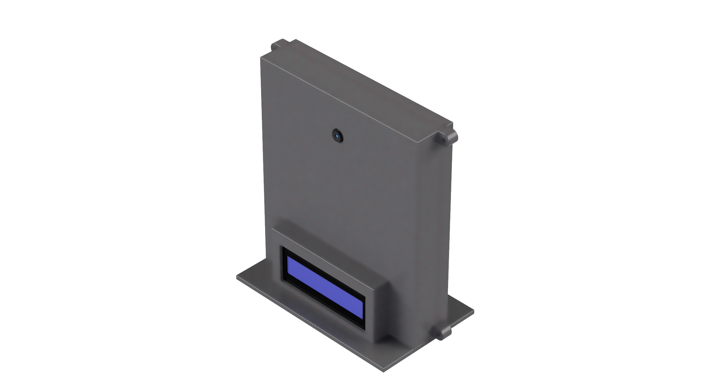
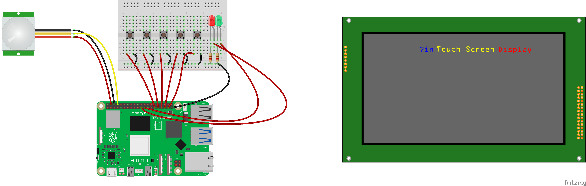

# Dibs — Smart Study Room Kiosk System

> **Automated room reservation management with real-time occupancy verification for NYU Dibner Library**

Dibs is a distributed IoT room management system that solves a simple but persistent problem: **nobody knows how many study rooms are actually being used at any given time.** Rooms get ghost-booked, stolen by people who never reserved, and there's zero accountability for no-shows.

This system pairs an outer kiosk (Raspberry Pi 5 with touchscreen, sensors, and physical buttons) with an inner occupancy module (ESP32-S3 with camera and LCD), all synchronized through Google Calendar API to a web booking interface — delivering real-time room status, automated check-in enforcement, and walk-in booking at **~$167 per unit** versus $749–$800+ for enterprise competitors.

Built as a Semester Long Design Project (SLDP) at NYU Tandon School of Engineering.

<p align="center">
  
</p>

<p align="center">
  <a href="https://youtu.be/KSitBOF_cG8">📺 Watch the full demo video</a>
</p>

---

## Table of Contents

- [Features](#features)
- [System Architecture](#system-architecture)
- [Hardware](#hardware)
- [Software Components](#software-components)
- [Room State Machine](#room-state-machine)
- [Tech Stack](#tech-stack)
- [Project Structure](#project-structure)
- [Setup & Installation](#setup--installation)
- [Configuration](#configuration)
- [How It Works](#how-it-works)
- [Competitive Analysis](#competitive-analysis)
- [Design Decisions & Tradeoffs](#design-decisions--tradeoffs)
- [Lessons Learned](#lessons-learned)
- [Future Improvements](#future-improvements)
- [Team](#team)

---

## Features

- **Real-time reservation display** — Shows current and upcoming bookings synced with Google Calendar
- **Walk-in booking** — 2-tap booking with dynamic duration limits based on next reservation and library hours
- **Check-in enforcement** — 10-minute check-in window with N-number authentication; no-shows auto-canceled
- **Occupancy verification** — Face detection via ESP32-CAM confirms room is actually in use
- **Physical button navigation** — Full GPIO-driven interface for accessible, touchscreen-free operation
- **Motion-activated display** — PIR sensor wakes screen on approach, sleeps after 30 seconds of inactivity
- **LED status indicators** — Green (available) / Red (occupied) visible from down the hallway
- **Context-aware LCD messaging** — Inner room display adapts messages based on face detection + room state
- **Adaptive polling** — Dynamic refresh rates (5–30s) based on proximity to check-in windows
- **Web + kiosk sync** — Bidirectional: bookings from either interface appear on both instantly

---

## System Architecture

```
┌──────────────────────────────────────────────────────────────────────┐
│                        RASPBERRY PI 5 (Outer Kiosk)                  │
│                                                                      │
│  ┌──────────────────┐  ┌──────────────────┐  ┌───────────────────┐  │
│  │  Main Kiosk GUI  │  │  Flask API Server │  │  Face Detection + │  │
│  │    (app.py)      │◄─│  (kiosk_api_     │◄─│  LCD Controller   │  │
│  │                  │  │   server.py)      │  │  (pi_cam_smart_  │  │
│  │  Kivy Framework  │  │                  │  │   lcd.py)         │  │
│  │  GPIO Buttons    │  │  /api/room_status │  │                  │  │
│  │  PIR Sensor      │  │  /api/health     │  │  OpenCV + cvzone  │  │
│  │  LED Control     │  │  /api/schedule   │  │  Headless mode    │  │
│  └──────────────────┘  └──────────────────┘  └────────┬──────────┘  │
│                                                        │             │
└────────────────────────────────────────────────────────┼─────────────┘
                                                         │
                                                   WiFi (HTTP)
                                                         │
┌────────────────────────────────────────────────────────┼─────────────┐
│                      ESP32-S3 CAM (Inner Module)       │             │
│                                                        │             │
│  ┌─────────────────────────────────────────────────────┘            │
│  │                                                                  │
│  │  Arduino Sketch (Station Mode)                                   │
│  │  - MJPEG Video Streaming (port 81)                               │
│  │  - HTTP endpoint for LCD text control (/lcd)                     │
│  │  - I2C 16x2 LCD Display Driver                                   │
│  │  - Connects to existing WiFi (not AP mode)                       │
│  │                                                                  │
└──────────────────────────────────────────────────────────────────────┘
                                    │
                            Google Calendar API
                                    │
┌───────────────────────────────────┼──────────────────────────────────┐
│                  Web Booking Interface (nyu-dibner-bookings.onrender.com)      │
│                  Built by Kashvi Rungta                                       │
│                  - Remote reservations                                        │
│                  - Same calendar as single source of truth                    │
└──────────────────────────────────────────────────────────────────────┘
```

<p align="center">
  
  <br>
  <em>Code architecture flowchart</em>
</p>

---

## Hardware

### Outer Device (Mounted outside room door)

<p align="center">
  
  
</p>

| Component | Purpose |
|---|---|
| Raspberry Pi 5 | Main compute, runs GUI + API + face detection |
| 7" Touchscreen (1920×1080) | Primary display |
| 5× GPIO Buttons | UP, DOWN, LEFT, RIGHT, SELECT navigation |
| Walk-In Button | Dedicated physical button for walk-in bookings |
| PIR Motion Sensor (GPIO 14) | Screen wake/sleep on approach |
| Red LED (GPIO 9) | Room occupied indicator |
| Green LED (GPIO 11) | Room available indicator |

### Inner Device (Mounted inside room)

<p align="center">
  
</p>

| Component | Purpose |
|---|---|
| ESP32-S3 with Camera | Video streaming for face detection |
| 16×2 I2C LCD (GPIO 41 SDA, GPIO 42 SCL) | Context-aware room messages |

### Circuit Diagrams

<p align="center">
  
  
</p>

### Cost Comparison

| | Dibs | Logitech Tap Scheduler | Joan 6 RE |
|---|---|---|---|
| Hardware | **~$167** | $799 | $749 + $239 mount |
| Software/month | **$0** (edu/nonprofit) | $40/mo | $25/mo |
| Occupancy verification | **Yes** | No | No |
| Display | 1920×1080 | 1280×800 | 1024×758 |

---

## Software Components

### Raspberry Pi 5

| File | Purpose |
|---|---|
| `app.py` + `app.kv` | Main Kivy GUI application and layout |
| `reservation_manager_calendar.py` | Business logic: states, check-in, walk-in, cancellation |
| `google_calendar_client.py` | Google Calendar API wrapper with timezone handling |
| `kiosk_api_server.py` | Flask REST API bridging face detection ↔ reservation system |
| `gpio_handler.py` | Physical button input via GPIO interrupts |
| `focus_manager.py` | Semantic navigation grid system across 8+ screen types |
| `pir_handler.py` | Motion sensor → screen wake/sleep control |
| `led_status_handler.py` | LED color control based on room state |
| `pi_cam_smart_lcd.py` | Face detection + smart LCD message logic |
| `weather.py` | Open-Meteo API integration for local weather display |
| `clock.py` | Real-time clock widget |
| `scheduler.py` | Schedule display and check-in button widgets |
| `config.py` | Room name, calendar ID, credentials path, admin password |
| `kiosk_startup_kivy.py` | Boot sequence: prompts for ESP32 IP, launches all components |

### ESP32-S3

| File | Purpose |
|---|---|
| `Sketch_STATION_MODE.ino` | Main Arduino sketch: WiFi, streaming, LCD, HTTP endpoints |
| `app_httpd.cpp` | HTTP request handlers for stream + LCD + button endpoints |
| `camera_pins.h` | Pin definitions for ESP32-S3-EYE camera model |

---

## Room State Machine

```
                    ┌──────────────┐
        ┌──────────│  AVAILABLE   │◄──────────┐
        │          │  (Green LED) │           │
        │          └──────┬───────┘           │
        │                 │                    │
        │    Reservation within 10 min         │  Booking ends
        │                 │                    │  or no-show canceled
        │                 ▼                    │
        │          ┌──────────────┐           │
        │          │  CHECK-IN    │───────────┘
        │          │   READY      │  (10 min, no check-in → auto-cancel)
        │          │  (Red LED)   │
        │          └──────┬───────┘
        │                 │
        │          User checks in
        │          (N-number validated)
        │                 │
        │                 ▼
        │          ┌──────────────┐
        └──────────│   OCCUPIED   │
   Walk-in ends    │  (Red LED)   │
                   └──────────────┘
```

---

## Tech Stack

**Languages:** Python 3, C++ (Arduino)

**Raspberry Pi Libraries:**
- `kivy` — Touchscreen GUI framework
- `flask` — REST API server
- `opencv-python` + `cvzone` — Face detection
- `google-api-python-client` + `google-auth` — Calendar API
- `RPi.GPIO` — Button, LED, PIR sensor control
- `requests` — HTTP communication to ESP32
- `pytz` — Timezone handling (UTC ↔ America/New_York)

**ESP32 Libraries:**
- `WiFi.h` — Station Mode networking
- `esp_camera.h` — Camera initialization and streaming
- `LiquidCrystal_I2C` — 16×2 LCD display driver

**Infrastructure:**
- Google Calendar API — Single source of truth for all reservations
- Render — Web booking interface hosting ([nyu-dibner-bookings.onrender.com](https://nyu-dibner-bookings.onrender.com/))
- Open-Meteo API — Weather data

---

## Project Structure

```
dibs/
├── README.md
├── LICENSE
│
├── kiosk/                          # Raspberry Pi 5 application
│   ├── app.py                      # Main Kivy application entry point
│   ├── app.kv                      # Kivy UI layout definitions
│   ├── reservation_manager_calendar.py  # Reservation business logic
│   ├── google_calendar_client.py   # Google Calendar API wrapper
│   ├── kiosk_api_server.py         # Flask REST API server
│   ├── gpio_handler.py             # Physical button input handling
│   ├── focus_manager.py            # Semantic navigation grid system
│   ├── pir_handler.py              # PIR motion sensor → screen control
│   ├── led_status_handler.py       # LED status indicator control
│   ├── weather.py                  # Weather API integration
│   ├── clock.py                    # Real-time clock widget
│   ├── scheduler.py                # Schedule display widgets
│   ├── config.py                   # System configuration
│   ├── kiosk_startup_kivy.py       # Boot launcher with ESP32 IP prompt
│   ├── run_gui_fullscreen.sh       # Fullscreen launch wrapper
│   └── requirements.txt            # Python dependencies
│
├── esp32/                          # ESP32-S3 firmware
│   └── Sketch_STATION_MODE/
│       ├── Sketch_STATION_MODE.ino # Main Arduino sketch
│       ├── app_httpd.cpp           # HTTP endpoint handlers
│       └── camera_pins.h           # Pin definitions
│
├── face-detection/                 # Occupancy detection (runs on Pi)
│   ├── pi_cam_smart_lcd.py         # Face detection + LCD message logic
│   └── requirements.txt            # OpenCV dependencies
│
├── web/                            # Web booking interface (deployed on Render, built by Kashvi Rungta)
│   └── ...                         # See: https://nyu-dibner-bookings.onrender.com/
│
├── enclosures/                     # Hardware design files
│   ├── outer_device.step           # Outer kiosk CAD model
│   └── inner_device.step           # Inner camera module CAD model
│
├── docs/                           # Documentation
│   ├── ARCHITECTURE.md             # Detailed system architecture
│   ├── SETUP_GUIDE.md              # Step-by-step installation
│   ├── WIRING.md                   # GPIO pin assignments + wiring diagram
│   ├── SOFTWARE_SETUP.md           # Software dependencies + configuration
│   └── images/                     # Architecture diagrams, photos, screenshots
│       ├── system_architecture.png
│       ├── state_machine.png
│       ├── outer_device_cad.png
│       ├── inner_device_cad.png
│       ├── kiosk_main_screen.png
│       ├── kiosk_checkin_screen.png
│       └── kiosk_walkin_screen.png
│
├── autostart/                      # Deployment configuration
│   └── kiosk-startup.desktop       # Linux autostart entry
│
└── .gitignore
```

---

## Setup & Installation

### Prerequisites

- Raspberry Pi 5 with Raspberry Pi OS (Wayland)
- ESP32-S3 with camera module (ESP32-S3-EYE or equivalent)
- 7" touchscreen display (1920×1080)
- PIR motion sensor, LEDs, GPIO push buttons
- Google Cloud service account with Calendar API enabled

### Raspberry Pi Setup

```bash
# Clone the repository
git clone https://github.com/yourusername/dibs.git
cd dibs

# Install Python dependencies
pip install kivy flask google-api-python-client google-auth pytz requests --break-system-packages

# Install OpenCV (in virtual environment recommended)
cd face-detection
python3 -m venv venv
source venv/bin/activate
pip install opencv-python cvzone requests

# Configure
cp kiosk/config.py.example kiosk/config.py
# Edit config.py with your calendar ID, room name, and credentials path
```

### ESP32-S3 Setup

1. Open `esp32/Sketch_STATION_MODE/Sketch_STATION_MODE.ino` in Arduino IDE
2. Update WiFi credentials (`ssid` and `password`)
3. Verify I2C LCD address (default: `0x27`)
4. Upload to ESP32-S3

### Running

```bash
# Option 1: Automated startup
python3 kiosk/kiosk_startup_kivy.py

# Option 2: Manual (3 terminals)
# Terminal 1: API server
python3 kiosk/kiosk_api_server.py

# Terminal 2: Face detection
cd face-detection && source venv/bin/activate
python3 pi_cam_smart_lcd.py --ip <ESP32_IP>

# Terminal 3: Main GUI
cd kiosk && python3 app.py
```

### Autostart on Boot

```bash
cp autostart/kiosk-startup.desktop ~/.config/autostart/
# Edit Exec path if needed
```

---

## Configuration

Edit `kiosk/config.py`:

```python
CALENDAR_CONFIG = {
    'credentials_file': 'key.json',       # Google service account key
    'calendar_id': 'your_calendar@group.calendar.google.com',
    'room_name': 'Study Room LC416',      # Must match web booking format
}

LIBRARY_HOURS = {
    'open': '07:00',    # 7 AM
    'close': '01:00',   # 1 AM (next day)
}

CHECK_IN_WINDOW_MINUTES = 10    # Minutes before start time to allow check-in
NO_SHOW_CANCEL_MINUTES = 10     # Minutes after start to cancel if not checked in
```

---

## How It Works

### Walk-In Flow
1. User approaches kiosk → PIR sensor wakes screen
2. User taps "Walk In" (or presses button) → Duration selection screen
3. User selects duration (limited by next reservation / library close)
4. Booking created in Google Calendar with `isWalkIn=true` and `checkedIn=true`
5. Walk-ins are **immune to no-show cancellation** — the act of walking in is the check-in

### Check-In Flow
1. Reservation starts within 10 minutes → Check-In button turns green
2. Walk-In button simultaneously disables (mutual exclusivity)
3. User enters 9-digit N-number → System validates against booking's `bookedBy` field
4. Google Calendar event updated with `checkedIn=true` and timestamp
5. If no check-in within 10 minutes after start → booking auto-deleted

### Occupancy Detection
1. ESP32-S3 streams MJPEG video on port 81
2. Pi runs OpenCV face detection on the stream (headless, no GUI window)
3. Face count + room state from API → context-aware LCD messages
4. LCD only updates when state changes (prevents visual flickering)

---

## Design Decisions & Tradeoffs

| Decision | Chosen | Alternative | Why |
|---|---|---|---|
| ESP32 network mode | **Station Mode** (connects to router) | Access Point (creates own network) | AP mode caused streaming lag; Station offloads networking to router |
| Data storage | **Google Calendar API** (cloud) | Local SQLite | Enables sync between kiosk and web interface; single source of truth |
| Navigation | **GPIO buttons + touchscreen** | Touchscreen only | Physical buttons provide accessible, reliable input; work even if touchscreen fails |
| Face detection compute | **Raspberry Pi** (edge) | ESP32 on-device | ESP32 lacks compute for real-time CV; Pi handles OpenCV efficiently |
| Polling strategy | **Adaptive (5–30s)** | Fixed interval | Saves API calls during idle; responsive during critical check-in windows |
| Walk-in check-in | **Atomic at creation** | Separate check-in step | Prevents race condition with no-show cancellation policy |

---

## Lessons Learned

- **Distributed systems fail at boundaries.** Timezone mismatches (UTC vs. Eastern) silently broke calendar queries for days before we caught it. Always normalize timezones explicitly.
- **Network mode matters more than you'd think.** The ESP32 in AP mode worked in testing but introduced unacceptable streaming lag under real conditions. Switching to Station Mode eliminated the issue entirely.
- **State tracking prevents noise.** Without tracking previous LCD state, the display was constantly refreshing with the same message, creating a distracting flicker. Only updating on state changes made the system feel polished.
- **Adaptive behavior beats fixed intervals.** A flat 30-second polling interval was too slow during check-in windows and wastefully fast during idle periods. Dynamic rates (5s critical, 30s idle) balanced responsiveness with API efficiency.
- **Wayland breaks assumptions.** Standard Linux display tools (`scrot`, `vcgencmd`) don't work on Wayland. Had to switch to `grim` for screenshots and overlay-based approaches for screen control.

---

## Future Improvements

- Real-time room availability dashboard for library staff
- Shorter focal length camera for better face detection in small rooms
- Email/push reminders before reservation start
- RFID/NFC card tap for faster check-in
- Open-source release with deployment documentation
- Multi-room management dashboard

---

## Team

**PR&R Solutions** — NYU Tandon School of Engineering, SLDP 2025

| Name | Role | Major |
|---|---|---|
| Nicholas Reinoso | Embedded systems, software development, CAD enclosure design, protoboard layout, computer vision, API integration | B.S. Electrical and Computer Engineering |
| Kashvi Rungta | Web booking interface and Pi integration ([nyu-dibner-bookings.onrender.com](https://nyu-dibner-bookings.onrender.com/)) | B.S. Computer Science |
| Jiya Patel | Project coordination and documentation support | B.S. Mechanical Engineering |

---

## License

This project is licensed under the MIT License — see [LICENSE](LICENSE) for details.
